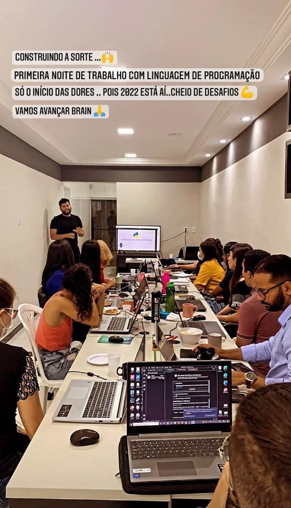

# Automação de Pesquisa e Coleta de Leads no Linkedin
Essa automação foi desenvolvida para um treinamento no qual a intenção era demonstrar alguns conceitos da linguagem de programação Python e de algumas bibliotecas de teste/automação como selenium e pyautogui para a empresa Brain Engenharia.

